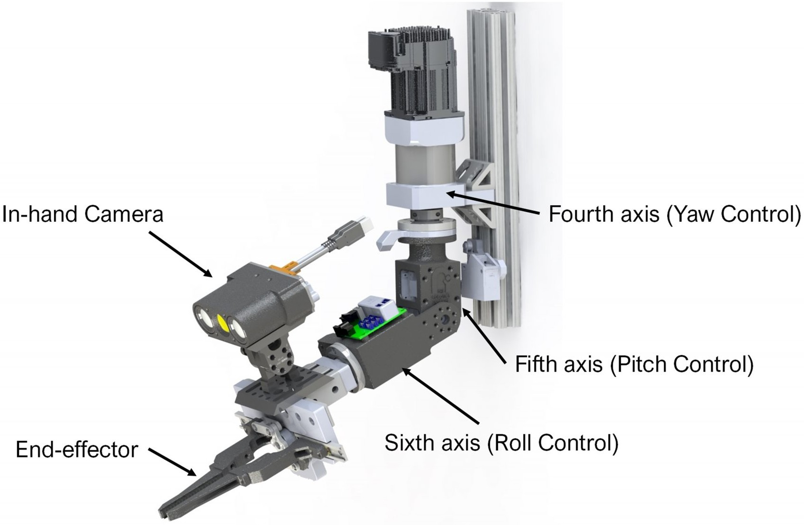
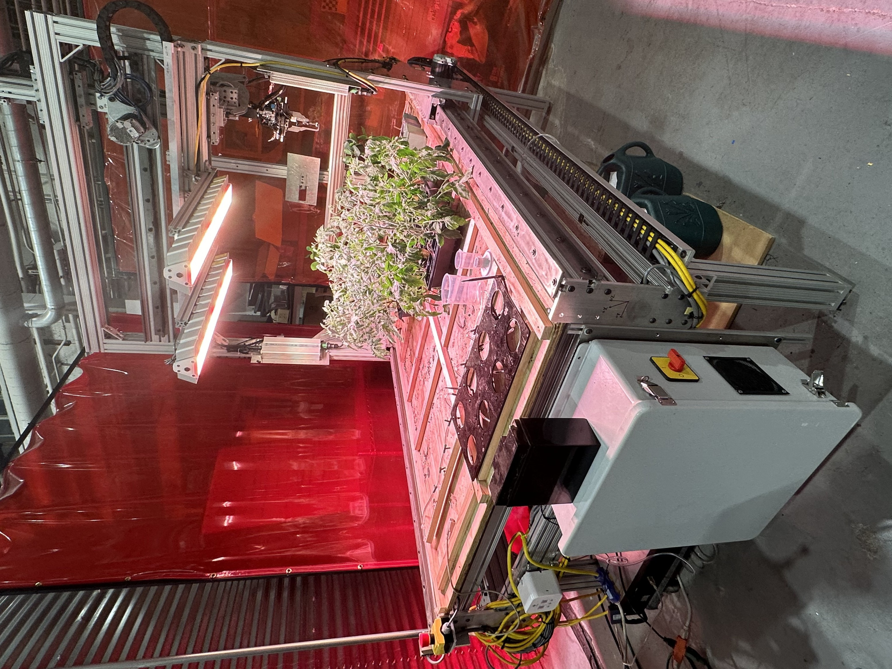

# REX-Robot: Gantry System for Plant Manipulation

|  |  |
|:---:|:---:|
| *End-effector design showing stereo camera and leaf manipulation system with 6-DOF control (Yaw, Pitch, Roll)* | *Full gantry system setup with integrated grow light system and plant monitoring station* |

## Overview
REX-Robot (Robot for Extracting leaf samples) is a sophisticated 6-DOF gantry-based robotic system designed for precise plant manipulation in agricultural settings. Developed in collaboration with Virginia Tech, the system combines high-precision motion control, advanced trajectory planning, and visual servoing to enable accurate leaf manipulation for early-stage plant disease detection.

## Partners and Sponsorship
- **Sponsor**: NIFA (National Institute of Food and Agriculture)
- **Partner**: Virginia Tech (PI Song Li)
- **Project Goal**: Early-stage plant disease detection in young tomato plants using autonomous Gantry robot with image collection, leaf sampling and genome sequencing capabilities
- **CMU Scope**: Development of robotic platform capable of autonomous multi-view imaging, point cloud processing and leaf grasping and cutting capabilities

## System Architecture

### Hardware Components
- **Gantry Configuration**: 6 degrees of freedom (X, Y, Z, Roll, Pitch, Yaw)
- **Actuation**: ClearPath servo motors with high-precision position control
- **End-Effector**: Custom gripper designed for leaf manipulation
- **Sensors**: Stereo camera system for visual feedback
- **Motion Control**: ClearPath SC-Hub interface for motor synchronization

### Software Architecture
The system is built on ROS with a modular architecture:

#### Core Components
- **gantry_driver**: Hardware interface for ClearPath motors
  - Custom state machine implementation for motor control
  - Multi-threaded execution for real-time performance
  - Supervisor node for coordinated multi-axis movements

- **gantry_description**: Robot model and configuration
  - URDF with accurate joint limits and dynamics
  - Custom transmission interfaces
  - Gazebo simulation support

- **gantry_move**: Motion planning and execution
  - Action server/client architecture for trajectory execution
  - Custom path planning integration
  - Real-time trajectory modification

- **gantry_moveit_config**: MoveIt! integration
  - OMPL planning pipeline configuration
  - Custom IK solver configuration
  - Planning scene management

### Tech Stack
- **Languages**: C++ (ROS drivers, motion control), Python (ROS nodes, configuration)
- **Frameworks & Libraries**:
    - ROS Noetic (core robotics framework)
    - MoveIt! (motion planning)
    - PCL (point cloud processing)
    - Eigen (mathematical operations)
    - OpenCV (image processing)
    - TF2 (coordinate transformations)
- **Hardware Interface**: 
    - ClearPath SDK (motor control)
    - Custom action servers/clients
    - Real-time control interfaces
- **Build & Development**:
    - CMake
    - catkin
    - RViz (visualization)
    - Gazebo (simulation)

## Technical Implementation

### Motion Planning & Control

#### Advanced Motion Planning Pipeline
1. **Multi-Stage Movement Coordination**
   - Pre-grasp trajectory generation with visual servoing
   - End-effector orientation control using quaternion algebra
   - Position-based control with dynamic velocity/acceleration scaling
   - Multiple planning attempts with replanning capability
   ```cpp
   move_group.setPlanningTime(10);
   move_group.setNumPlanningAttempts(10);
   move_group.allowReplanning(true);
   ```

2. **State-Machine Based Execution**
   - Sophisticated movement sequencing:
     * Loading phase → Mid-center → Final position
   - Real-time trajectory adjustment
   - Parallel control and perception execution
   - Error detection and recovery

3. **End-Effector Control**
   - Quaternion-based orientation control
   - Dynamic RPY (Roll-Pitch-Yaw) adjustments
   - Visual servoing feedback integration

#### Control System Architecture
1. **Low-Level Control**
   - ClearPath motor interfacing through sFoundation SDK
   - Real-time position and velocity control
   - Multi-axis synchronization

2. **Mid-Level Control**
   - Action server/client architecture for command execution
   - Real-time state monitoring and feedback
   - Synchronized joint trajectory control

3. **High-Level Control**
   - Task sequencing and coordination
   - Safety constraint enforcement
   - Error handling and recovery
   - Movement validation and verification

## Installation
Prerequisites:
- ROS Noetic
- MoveIt!
- ClearPath Motor SDK

Dependencies:
```bash
sudo apt-get install ros-noetic-moveit
sudo apt-get install ros-noetic-joint-trajectory-controller
```

## Usage

### Real Robot Operation
```bash
# 1. Initialize reference frame
rosrun tf static_transform_publisher 0.0 0.0 0.0 0.0 0.0 0.0 /world /base_link 100
rosrun tf static_transform_publisher 0.0 0.0 0.0 0.0 0.0 0.0 /world /base 100

# 2. Launch core components
rosrun gantry_driver gantry_driver_server
roslaunch dynamixel_workbench_controllers dynamixel_controllers.launch

# 3. Launch MoveIt! planning pipeline
roslaunch gantry_moveit_config planning_context.launch load_robot_description:=true limited:=true
roslaunch gantry_moveit_config gantry_moveit_planning_execution.launch limited:=true

# 4. Launch visualization
roslaunch gantry_moveit_config moveit_rviz.launch config:=true

# 5. System initialization
rostopic pub /ping std_msgs/String "t" -r 50
rostopic pub /do_calib_n std_msgs/String "data: ''" -1
```

<div style="text-align: center;">
    
    <p><em>Real robot demonstration showing autonomous leaf detection, approach planning, and precision grasping (Playback speed: 2x)</em></p>
</div>

### Simulation
```bash
# 1. Launch Gazebo simulation
roslaunch gantry_gazebo gantry_joint_limited.launch gui:=false

# 2. Launch MoveIt! planning pipeline
roslaunch gantry_moveit_config gantry_moveit_planning_execution.launch limited:=true sim:=true

# 3. Launch visualization
roslaunch gantry_moveit_config moveit_rviz.launch config:=true

# 4. Launch move server and client
rosrun gantry_move gantry_move_server
rosrun gantry_move gantry_move_client
```

<div style="text-align: center;">
    
    <p><em>MoveIt! simulation demonstrating motion planning and collision-aware trajectory generation (Playback speed: 2x)</em></p>
</div>

## License
This project is licensed under the BSD 3-Clause License - see the [LICENSE](LICENSE) file for details.

## Related Projects
[PLACEHOLDER: Links to related repositories]